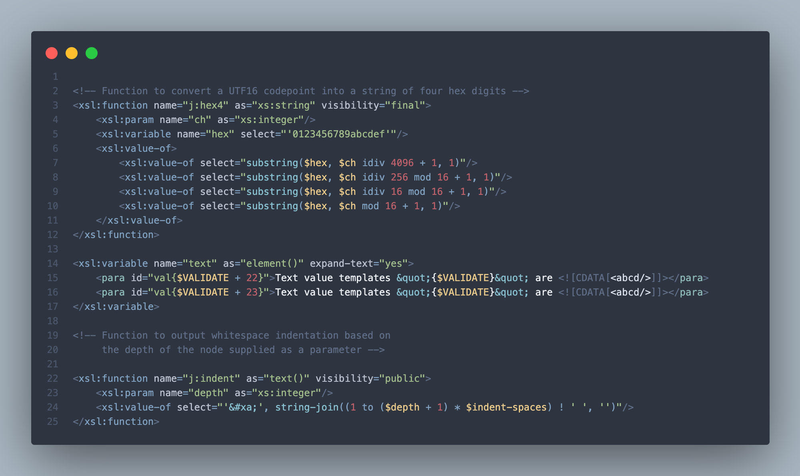

# Nord-XSLT Visual Studio Code

This Visual Studio Code extension provides a dark color theme enhanced specifically for XSLT 3.0. This theme is based on the  <a href="https://marketplace.visualstudio.com/items?itemName=arcticicestudio.nord-visual-studio-code">Nord Visual Studio Code</a> theme: . 

> 
An arctic, north-bluish clean and elegant <a href="https://code.visualstudio.com" target="_blank">Visual Studio Code</a> theme.
>
> Designed for a fluent and clear workflow based on the <a href="https://www.nordtheme.com/">Nord</a> color palette.

Semantic token color settings have been added specifically for enhancing the rendering of XSLT 3.0 code.

*Screenshot of sample XSLT 3.0*

---

The only change is the addition of the `semanticTokenColors` property to the `color-theme.json` file.

